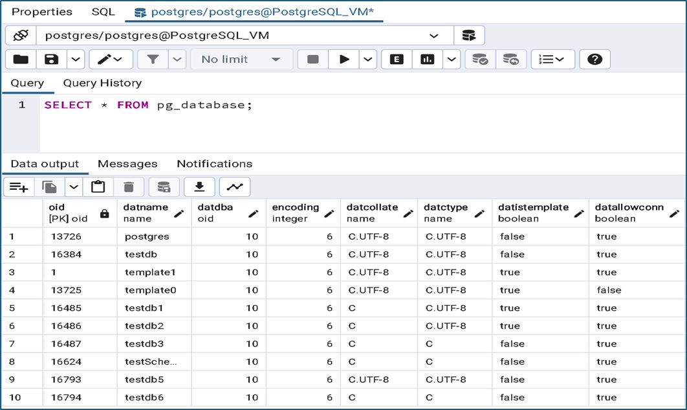
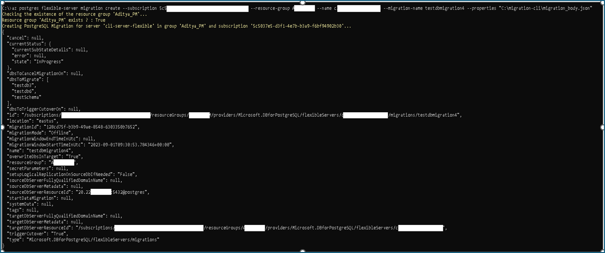
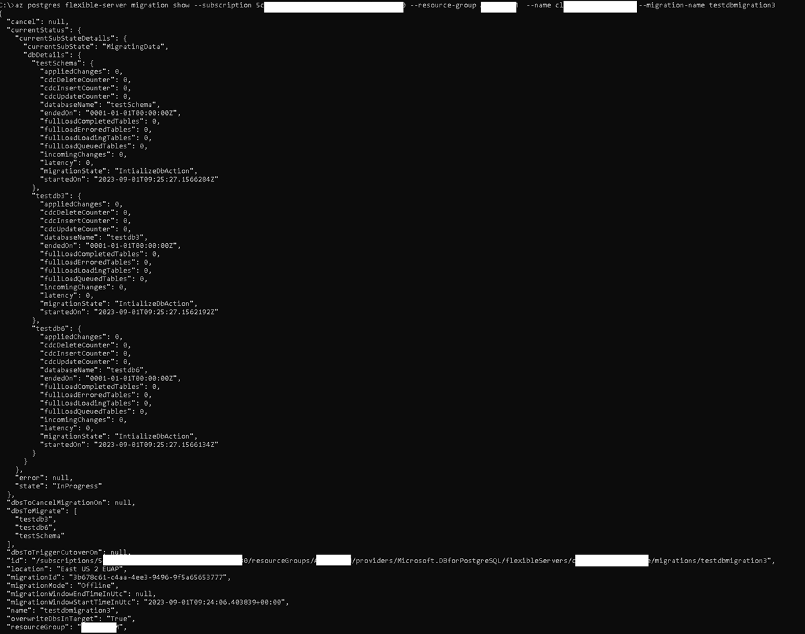
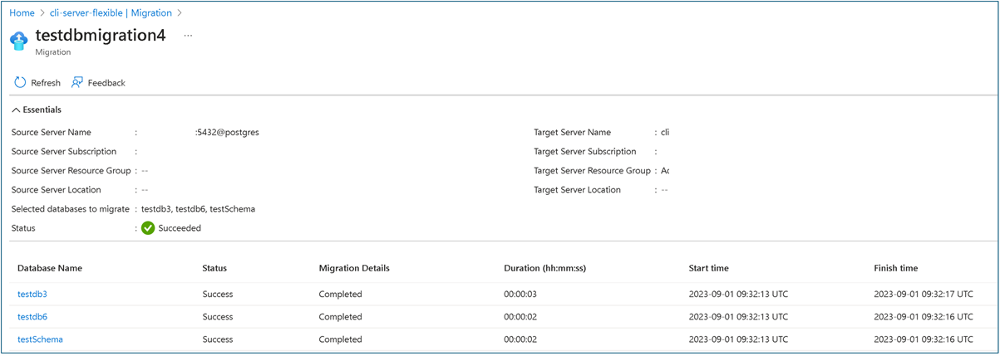

# Tutorial: Offline migration of On-Premises/IaaS to Azure Database for PostgreSQL - Flexible server using the Azure CLI

## Overview

You can migrate the PostgreSQL instance from IaaS/On-Premises to Azure Database for PostgreSQL – Flexible Server using the Azure Command Line Interface (CLI). This document provides the detailed steps to migrate your PostgreSQL instances located in on-premises/Azure VM/IaaS based solutions to Azure Database for PostgreSQL – Flexible Server using CLI based approach.
We spin up a purpose-built docker container in the target Azure Database for PostgreSQL – Flexible Server and drive the incoming migrations. This docker container spins up on-demand when a migration is initiated from On-premises/IaaS based solutions and gets decommissioned once the migration is completed. The migration container uses a new binary called [pgcopydb](https://github.com/dimitri/pgcopydb) that provides a fast and efficient way of copying databases from one server to another.

## How can it be initiated?
The migration service is currently exposed through easy-to-use Azure CLI commands. You can perform migrations, list migrations, etc using these CLI commands.

## Pre-Requisites

### Azure CLI Setup

* Install the Azure CLI depending on the operating system to run the CLI commands.
* Azure CLI can be installed from - [How to install the Azure CLI | Microsoft Learn](https://learn.microsoft.com/en-us/cli/azure/install-azure-cli)
* In case Azure CLI is already installed, check the version by issuing az version command. The version should be at least 2.50.0 or above to use the private preview version of the CLI commands. If not, please update your Azure CLI using the following link.
* Once installed, run the az login command. This will open the default browser and load an Azure sign-in page to authenticate. Pass in your azure credentials to do a successful authentication. For other ways to sign with Azure CLI, visit this link.

### Target Setup

* Before starting the migration, Azure Database for PostgreSQL – Flexible server must be created. 
* SKU provisioned for Azure Database for PostgreSQL – Flexible server should be matching with the source.
* To create new Azure Database for PostgreSQL – Flexible server, refer link - [Quickstart: Create server - Azure portal - Azure Database for PostgreSQL - Flexible Server | Microsoft Learn](https://learn.microsoft.com/en-us/azure/postgresql/flexible-server/quickstart-create-server-portal)
 
### Source version
Source PostgreSQL version should be >= 9.5

### Networking
Networking is required to establish a successful connectivity between source and target.
* You need to setup Express route/ IP Sec VPN/ VPN tunnelling while connecting your source from on-premises to Azure. Below table provides the networking scenario that can guide you with the connectivity setup

The following table can help for setting up the network between source and target
| Source | Target | Connectivity Tips |
| ---- | ---- | ---- |
| Public | Public | No action needed. Connectivity should be established automatically. Provided the source is whitelisted in the firewall rules. |
| Private | Public | Non supported network configuration, need to use pg_dump/pg_restore |
| Public | Private | No action needed. Connectivity should be established automatically. Provided the source is whitelisted in the firewall rules of the target. |
| Private | Private | You need to establish Express route or IP Sec VPN, or VPN Tunnelling or VNET Peering between source and target. |

* Along with establishing Azure connectivity, check the pg_hba.conf file to ensure the target PostgreSQL flexible server can connect to the source. It requires Source PostgreSQL instance to be restarted.
* To establish Express route - [Azure ExpressRoute Overview: Connect over a private connection | Microsoft Learn](https://learn.microsoft.com/en-us/azure/expressroute/expressroute-introduction)
* For setting up IP Sec VPN, you can refer - [About Azure Point-to-Site VPN connections - Azure VPN Gateway | Microsoft Learn](https://learn.microsoft.com/en-us/azure/vpn-gateway/point-to-site-about)
* For VNET Peering, [Azure Virtual Network peering | Microsoft Learn](https://learn.microsoft.com/en-us/azure/virtual-network/virtual-network-peering-overview)

### Extensions
* Use the select command in the source to list all the extensions that are being used - `Select * from pg_extensions;`
* Search for azure.extensions server parameter on the Server parameter blade on your Azure Database for PostgreSQL – Flexible server. Enable the extensions found in the source within the PostgreSQL flexible server.


* Check if the list contains any of the following extensions - 
    * PG_CRON
    * PG_HINT_PLAN
    * PG_PARTMAN_BGW
    * PG_PREWARM
    * PG_STAT_STATEMENTS
    * PG_AUDIT
    * PGLOGICAL
    * WAL2JSON
If yes, go to the server parameters blade and search for shared_preload_libraries parameter. This parameter indicates the set of extension libraries that are preloaded at the server restart.


### Users and Roles
* The users, different roles must be migrated manually to the Azure Database for PostgreSQL – Flexible server.
* Azure Database for PostgreSQL – Flexible server does not support any superuser, users having roles of superuser needs to be removed before migration.

### Server Parameters
* You need to manually configure the server parameter values in the Azure Database for PostgreSQL – Flexible server based on the server parameter values configured in the source.
* You can also configure the server parameters in the target using the CLI - [Configure parameters - Azure Database for PostgreSQL - Flexible Server | Microsoft Learn](https://learn.microsoft.com/en-us/azure/postgresql/flexible-server/howto-configure-server-parameters-using-cli)

## Starting with CLI
The preview comes with a list of easy-to-use CLI commands to perform migration related tasks. All the CLI commands starts with “az postgres flexible-server migration”. There are also help statements provided to assist you in understanding the various options and in framing the right syntax for the CLI commands.
CLI commands for migrating from On-premises/IaaS to Azure Database for PostgreSQL – Flexible server is almost like the CLI commands used to migrate from Azure Database for PostgreSQL – Single server to Azure Database for PostgreSQL – Flexible server.
At present for offline migration, CLI commands is in GA that supports migration from Azure Database for PostgreSQL – Single server to Azure Database for PostgreSQL – Flexible server [Tutorial: Migrate Azure Database for PostgreSQL - Single Server to Flexible Server using the Azure CLI - Azure Database for PostgreSQL Flexible Server | Microsoft Learn](https://learn.microsoft.com/en-us/azure/postgresql/migrate/how-to-migrate-single-to-flexible-cli)
Once the CLI is installed, open the command prompt and login into the azure account using the below command.

Example with Windows command prompt - 
`az login`


## Commands
Let us take a deep dive of the CLI commands.

### help
Command ```az postgres flexible-server migration –-help``` will provide the name and the corresponding verbs that are supported in preview. 


### create
The create command helps in creating a migration from a source server to target server.

The help command will allow users to understand the different arguments used for creating and initiating the migration `az postgres flexible-server migration create --help`


Example - 
```bash
az postgres flexible-server migration create --subscription 11111111-1111-1111-1111-111111111111 --resource-group my-learning-rg --name myflexibleserver --migration-name migration1 --properties "C:\Users\Administrator\Documents\migrationBody.JSON" --migration-mode offline
```
Different substates flow when the create command is triggered - 
* The migration moves to the InProgress state and the PerformingPreRequisiteSteps substate. 
* After the PerformingPreRequisiteSteps substate is completed, the migration moves to the substate of Migrating Data, where the Cloning/Copying of the databases take place.
* Each database migrated has its own section with all migration details, such as table count, incremental inserts, deletions, and pending bytes.
* The time that the Migrating Data substate takes to finish depends on the size of databases that are migrated.
* The migration moves to the Succeeded state as soon as the Migrating Data substate finishes successfully. If there's a problem at the Migrating Data substate, the migration moves into a Failed state.

Let us understand details of each parameter used in the create command –

| Parameter Name | Description |
| ---- | ---- |
| `subscription` | Subscription ID of PostgreSQL Flexible server |
| `resource-group` | Resource group of PostgreSQL Flexible server |
| `name` | Name of the PostgreSQL Flexible server |
| `migration-name` | Unique identifier to migrations attempted to Flexible Server. This field accepts only alphanumeric characters and does not accept any special characters, except a hyphen (-). The name can't start with -, and no two migrations to a Flexible Server target can have the same name. |
| `migration-mode` | This is an optional parameter. Default value: Offline. Offline migration involves copying of your source databases at a point in time, to your target server. |
| `properties` | Absolute path to a JSON file that has the information about the source server |

You need to provide a JSON file with the absolute path as parameter while initiating the migration. The properties of the JSON file are – 
| Property Name | Description |
| ----- | ----- |
| `sourceDbServerResourceId` | Source server details in the format - `<<hostname or IP address>>:<<port>>@<<username>>` |
| `AdminCredentials` | These parameter lists passwords for admin users for both the source server and the target PostgreSQL flexible server. These passwords help to authenticate against the source and target servers |
| `targetServerUserName` | The default value is the admin user created during the creation of flexible server and the password provided will be used for authentication against this user. In case you are not using the default user, this parameter is the user or role on the target server used for performing the migration. This user should be a member of azure_pg_admin, pg_read_all_settings, pg_read_all_stats, pg_stat_scan_tables roles and should have the Create role, Create DB attributes |
| `dbsToMigrate` | Specify the list of databases that you want to migrate to Flexible Server. You can include a maximum of eight database names at a time. Providing the list of DB’s in array format. |
| `OverwriteDBsInTarget` | When set to true (default), if the target server happens to have an existing database with the same name as the one you're trying to migrate, migration tool automatically overwrites the database |
| `MigrationMode` | Mode of the migration. Supported value is "Offline" |

### list
The list command lists all the migration attempts made to a Azure Database for PostgreSQL – Flexible server target.
```bash
az postgres flexible-server migration list [--subscription] [--resource-group][--name] [--filter]
```
| Parameter Name | Description |
| ----- | ----- |
| `subscription` | Subscription ID of PostgreSQL Flexible server target |
| `resource-group` | Resource group of PostgreSQL Flexible server target |
| `name` | Name of the PostgreSQL Flexible server target |
| `filter` | To filter migrations, two values supported – Active and All |

### show
The show command helps you monitor ongoing migrations and gives the current state and substate of the migration. These details include information on the current state and substate of the migration.
```bash
az postgres flexible-server migration show [--subscription][--resource-group][--name][--migration-name]
```
| Parameter Name | Description |
| ----- | ----- |
| `subscription` | Subscription ID of PostgreSQL Flexible server target |
| `resource-group` | Resource group of PostgreSQL Flexible server target |
| `name` | Name of the PostgreSQL Flexible server target |
| `migration-name` | Unique identifier to migrations attempted to Flexible Server. This field accepts only alphanumeric characters and does not accept any special characters, except a hyphen (-). The name can't start with -, and no two migrations to a Flexible Server target can have the same name. |

Different states and sub-states supported within show command

| Migration State | Description |
| ----- | ----- |
| `InProgress` | The migration infrastructure is set up, or the actual data migration is in progress |
| `Canceled` | The migration is canceled or deleted |
| `Failed` | The migration has failed |
| `Succeeded` | The migration has succeeded and is complete |

| Migration SubState | Description |
| ----- | ----- |
| `PerformingPreRequisiteSteps` | Infrastructure is set up and is prepped for data migration |
| `MigratingData` | Data migration is in progress |
| `Completed / Failed` | Migration is completed or failed |

## End to end flow tutorial
In this tutorial, we will be migrating PostgreSQL database residing in Azure VM with public access to Azure Database for PostgreSQL – Flexible server using Azure CLI.

### Step 1 - Connect to the source
* In this tutorial, source PostgreSQL version used is 14.8 and it is installed in one of the Azure VM with operating system as Ubuntu.
* Source PostgreSQL instance contains around 10 databases and for this tutorial we are going to migrate “testdb3, testdb6, and testschema” into Azure Database for PostgreSQL – Flexible server.



### Step 2 - Create target Azure Database for PostgreSQL – Flexible server
We used the [QuickStart guide](https://learn.microsoft.com/en-us/azure/postgresql/flexible-server/quickstart-create-server-portal) to create a corresponding PostgreSQL target flexible server. We kept the SKU same and given we are just migrating a small sample database; we are allocating 128 GB of storage. Below is the target server screenshot once created –


### Step 3 - Setup the pre-requisites
Ensure that all the pre-requisites are completed before start of migration.
* Networking establishment between source and target.
* For this tutorial, we have modified the pg_hba.conf file in the source


* Azure CLI environment and all the appropriate defaults are setup.
* Extensions are allowed listed and included in shared-load libraries.
* Users and Roles are migrated.
* Server Parameters are configured appropriately.

### Step 4 - Perform migration using CLI
* Open the command prompt and login into the Azure using `az login` command


* Edit the below placeholders `<< >>` in the JSON lines and store in the local machine as `<<filename>>.json` where the CLI is being invoked. In this tutorial, we have saved the file in C:\migration-cli\migration_body.json

```bash
{
"properties": {
"SourceDBServerResourceId": "<<hostname or IP address>>:<<port>>@<<username>>",
		"SecretParameters": {
			"AdminCredentials": {
				"SourceServerPassword": "<<Source Password>>",
				"TargetServerPassword": "<<Target Password>>"
			}
		},
     "targetServerUserName":"<<Target username>>",
		"DBsToMigrate": [
			<< comma separated list of databases like -"testdb3","testdb2","testdb1" >>
		],
		"OverwriteDBsInTarget": "true",
		"MigrationMode": "Offline"
	}
}
```
* Run the following command, to check if there are any migrations already performed. The migration name is the unique across the migrations within the Azure Database for PostgreSQL – Flexible server target.
'''bash
az postgres flexible-server migration list --subscription <<subscription ID>> --resource-group <<resource group name>> --name <<Name of the Flexible Server>> --filter All
'''


* In the above steps, there are no migrations performed so we will start with the new migration by running the following command –
'''bash
az postgres flexible-server migration create --subscription <<subscription ID>> --resource-group <<resource group name>> --name <<Name of the Flexible Server>> --migration-name <<Unique Migration Name>> --properties "C:\migration-cli\migration_body.json"
'''


* Run the following command to get the status of the migration that got initiated in the previous step. You can check the status of the migration by providing the migration name
'''bash
az postgres flexible-server migration show --subscription <<subscription ID>> --resource-group <<resource group name>> --name <<Name of the Flexible Server>> --migration-name <<Migration ID>>
'''


* You can also see the status in the Azure Database for PostgreSQL – Flexible server portal



### Step 5 - Post Migration
After successful completion of the databases, you need to manually validate the data between source and target and verify all the objects in the target database has been successfully created.

## Migration best practices

For a successful end-to-end migration, follow the post-migration steps in [Migrate to Azure Database for PostgreSQL - Flexible Server](https://learn.microsoft.com/azure/postgresql/migrate/concepts-single-to-flexible#post-migration). After you complete the preceding steps, you can change your application code to point database connection strings to Flexible Server. You can then start using the target as the primary database server.
