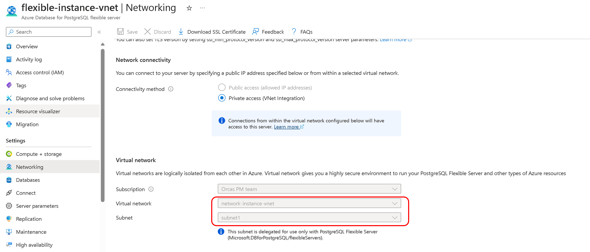

# Network guide using Migration Runtime Server

This document outlines networking scenario for connecting a source PostgreSQL instance to an Azure Database for PostgreSQL using the migration runtime server. Specific details vary based on the actual network setup and requirements of the source and target environments.

To configure network connectivity for migrations from an Azure Database for PostgreSQL - Single Server with a private endpoint to a Azure Database for PostgreSQL - Flexible Server with a private endpoint, using a VNet-integrated Flexible Server as the Migration Runtime Server, ensure private endpoint details, VNet peering, and DNS configurations are in place. This setup is also applicable for sources like on-premises databases, Azure VMs, or AWS instances with private IP access.

**Gather Private Endpoint Details for Single Server**

- Access the Azure portal and locate the Azure Database for PostgreSQL - Single Server instance.
- Record the Virtual Network (VNet) and subnet details listed under the private endpoint connection of the Single Server.

**Gather Private Endpoint Details for Flexible Server**

- Access the Azure portal and locate the Azure Database for PostgreSQL - Flexible Server instance.
- Record the Virtual Network (VNet) and subnet details listed under the private endpoint connection of the Flexible Server.

**Gather VNET details for Migration Runtime Server**

- Access the Azure portal and locate the migration runtime server i.e. Azure Database for PostgreSQL - Flexible Server (VNETc Integrated) instance.
- Record the Virtual Network (VNet) and subnet details listed under the virtual network.

**Assess VNet Peering Requirements**

- Enable VNet peering if the servers are in different VNets; no peering is needed if they are in the same VNet but different subnets.
- Ensure no NSGs are blocking traffic between the source, migration runtime and target servers.

**Private DNS Zone Configuration**

- Verify the use of a private DNS zone in the Networking blade of the Migration Runtime Server.
- Ensure both source Azure Database for PostgreSQL - Single Server and target Azure Database for PostgreSQL - Flexible Server VNets are linked to the private DNS zone of the migration runtime server

- Attach a private DNS zone to the Single Server's private endpoint if not already configured.
- Add virtual network links for the Single Server and Migration Runtime Server to the private DNS zone.
- Repeat the DNS zone attachment and virtual network linking process for the Flexible Server's private endpoint.

