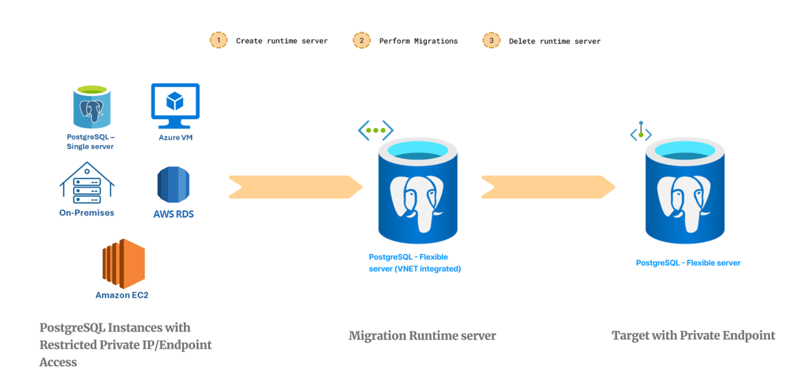

# Introduction to Migration runtime server within migration service in Azure Database for PostgreSQL Preview

## Overview

The Migration Runtime Server is a specialized feature within the [migration service in Azure Database for PostgreSQL](https://learn.microsoft.com/en-us/azure/postgresql/migrate/migration-service/concepts-migration-service-postgresql), designed to act as an intermediary server during the migration process. It is a separate Azure Database for PostgreSQL - Flexible Server instance that is not the target server but is used to facilitate the migration of databases from a source environment that is only accessible via a private network.

The migration runtime server is particularly useful in scenarios where both the source PostgreSQL instances and the target Azure Database for PostgreSQL Flexible Server are configured to communicate over private endpoints or private IPs, ensuring that the migration occurs within a secure and isolated network space. The Migration Runtime Server handles the data transfer, connecting to the source PostgreSQL instance to retrieve data and then pushing it to the target server.

The migration runtime server server is distinct from the target server and is specifically configured to handle the data transfer process, ensuring a secure and efficient migration path.

> [!NOTE]
> Migration runtime server using Azure portal experience is in preview mode.

## Supported migration Scenarios with the Migration Runtime Server

The migration runtime server is essential for transferring data between different source PostgreSQL instances and the Azure Database for PostgreSQL - Flexible Server. It is particularly necessary in the following scenarios:

- When the source is an Azure Database for PostgreSQL - Single Server configured with a private endpoint, and the target Azure Database for PostgreSQL - Flexible Server with a private endpoint.
- For sources such as on-premises databases, Azure VMs, or AWS instances that are only accessible via private networks, and the target Azure Database for PostgreSQL - Flexible Server with a private endpoint.
- For sources such as on-premises databases, Azure VMs, or AWS instances that are only accessible via private networks, and the target Azure Database for PostgreSQL - Flexible Server with a public access.

## How do you use the Migration Runtime Server feature?

To use the Migration Runtime Server feature within the migration service in Azure Database for PostgreSQL, follow these steps in the Azure portal:

- Log into the Azure portal and access the migration service in Azure Database for PostgreSQL.
- Begin a new migration workflow within the service.
- When you reach the "Select runtime server" tab, opt to use the Migration Runtime Server by selecting "Yes."
- Choose your Azure subscription and resource group where the VNet-integrated Azure Database for PostgreSQL - Flexible server is located.
- Select the appropriate Azure Database for PostgreSQL Flexible Server that will serve as your Migration Runtime Server.

## Migration Runtime Server essentials

- **Minimal Configuration** - Despite being created from an Azure Database for PostgreSQL Flexible Server, the migration runtime server's role is to solely facilitate migration, without the need for HA, backups, version specificity, or advanced storage features.
- **Performance and Sizing** - The migration runtime server should be adequately sized to handle the workload of the migration process.
- **Networking** Ensure that the migration runtime server is properly integrated into the Virtual Network (VNet) and that network security allows for secure communication with both the source and target servers.
- **Cleanup Post-Migration** - After the migration is complete, the migration runtime server should be decommissioned to avoid unnecessary costs. Ensure all data has been successfully migrated and that the server is no longer needed before deletion.

## Limitations

- The Migration Runtime Server is specifically designed to operate with the default private DNS zone i.e., **privatelink.postgres.database.azure.com**. Custom DNS names are not supported by the migration service when utilizing the migration runtime server feature. When configuring private endpoints for both the source and target databases, it is imperative to use the default private DNS zone provided by Azure for the private link service. The use of custom DNS configurations is not yet supported and may lead to connectivity issues during the migration process.
- All other limitations related to the migration service in Azure Database for PostgreSQL are also applicable. Please refer the [known issues and limitations documentation](https://learn.microsoft.com/en-us/azure/postgresql/migrate/migration-service/concepts-known-issues-migration-service)