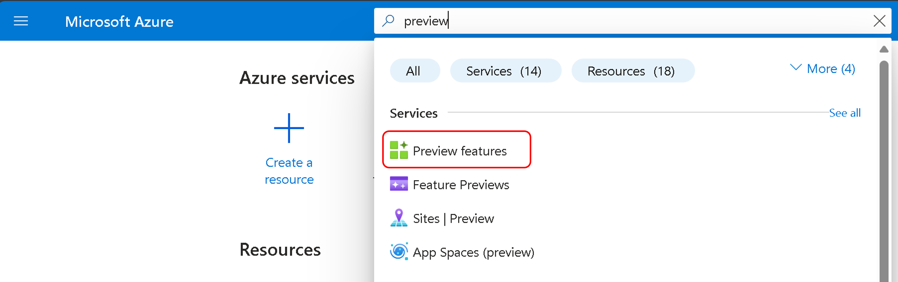
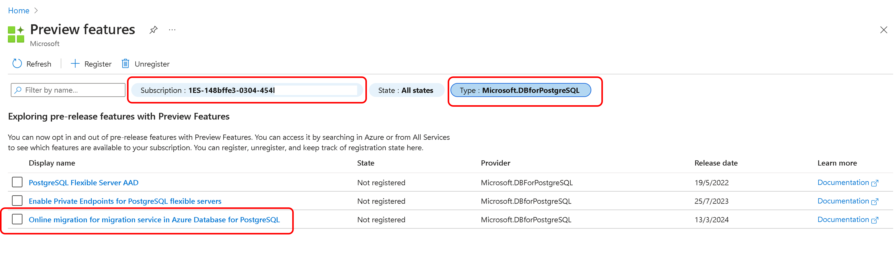

# Migrate PostgreSQL instances to Azure Database for PostgreSQL - Flexible server

## About Azure Database for PostgreSQL - Flexible server

Azure Database for PostgreSQL - Flexible Server is a fully managed database service designed to provide more granular control and flexibility over database management functions and configuration settings. The service generally provides more flexibility and server configuration customizations based on user requirements. The Azure Database for PostgreSQL - Flexible Server architecture allows users to collocate the database engine with the client tier for lower latency and choose high availability within a single availability zone and across multiple availability zones. Azure Database for PostgreSQL - Flexible Servers also provide better cost optimization controls with the ability to stop/start your server and a burstable compute tier ideal for workloads that don't need full compute capacity continuously.

## Overview of migration service in Azure Database for PostgreSQL

The migration service in Azure Database for PostgreSQL simplifies the process of moving your PostgreSQL databases to Azure, offering migration options from an Azure Database for PostgreSQL single server, AWS RDS for PostgreSQL, on-premises servers, and Azure virtual machines (VMs). The migration service is designed to help you move to Azure Database for PostgreSQL - Flexible Server with ease and confidence.

In this document, we provide a walk-through of how to perform migrations for different scenarios from your Azure Database for PostgreSQL-Single server/on-premises/IaaS/AWS to Azure Database for PostgreSQL - Flexible server in simple, efficient and a hassle-free way.

## Key Benefits

Key benefits of using the migration service are -  

* Managed migration service.
* No complex setup/pre-requisites required.
* Simple to use portal-based migration experience.
* Fast offline migration service.
* No limitations in terms of size of databases it can handle.
* Support for Schema and Data migrations

## Using Migration runtime server

The Migration Runtime Server is a specialized feature within the [migration service in Azure Database for PostgreSQL](https://learn.microsoft.com/en-us/azure/postgresql/migrate/migration-service/concepts-migration-service-postgresql), designed to act as an intermediary server during the migration process.

- [**Introduction to Migration runtime server within migration service in Azure Database for PostgreSQL**](migration-service-Azure-DB-PostgreSQL/Migration-Runtime-Server/overview.md)

## Start your offline migration

Get started with the offline migration from on-premises/IaaS/AWS to Azure Database for PostgreSQL - Flexible server by using one of the following methods:

- [**Using the Azure ARM Template - Migrate from IaaS to Azure Database for PostgreSQL - Flexible server (Offline)**](migration-service-Azure-DB-PostgreSQL/Offline-Migrations/IaaS-to-Flexible-offline-migration-using-ARM-Template.md)

## Start your online migration

- Sign in to the Azure Portal at https://portal.azure.com.
- Search for "Preview features" in the Azure portal search bar.

- In the Preview features section, provide your Azure subscription details.
- Choose Microsoft.DBforPostgreSQL as the type.
- Select "Online migration for migration service in Azure Database for PostgreSQL" from the list.
- Click "Register" to get the access to the preview feature.

Get started with the online migration from on-premises/IaaS/AWS to Azure Database for PostgreSQL - Flexible server by using one of the following methods:

- [**Using the Azure CLI - Migrate from IaaS to Azure Database for PostgreSQL - Flexible server (Online)**](migration-service-Azure-DB-PostgreSQL/Online-Migrations/IaaS-to-Flexible-online-migration-using-cli.md)
- [**Using the Azure Portal - Migrate from IaaS to Azure Database for PostgreSQL - Flexible server (Online)**](migration-service-Azure-DB-PostgreSQL/Online-Migrations/IaaS-to-Flexible-online-migration-using-portal.md)

## Current Limitations [Preview Mode]

- For a comprehensive list of known issues and limitations related to the migration service in Azure Database for PostgreSQL, please refer to the official documentation - [Migration service in Azure Database for PostgreSQL](https://learn.microsoft.com/en-us/azure/postgresql/migrate/migration-service/concepts-known-issues-migration-service)
