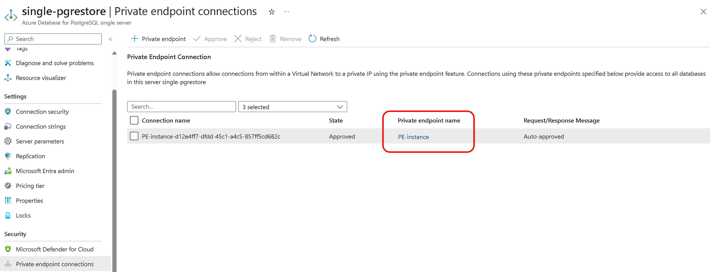
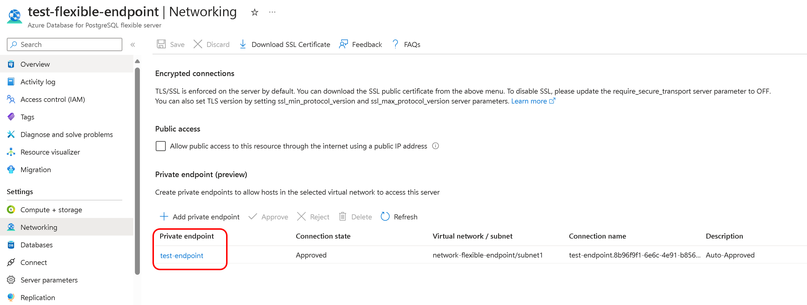
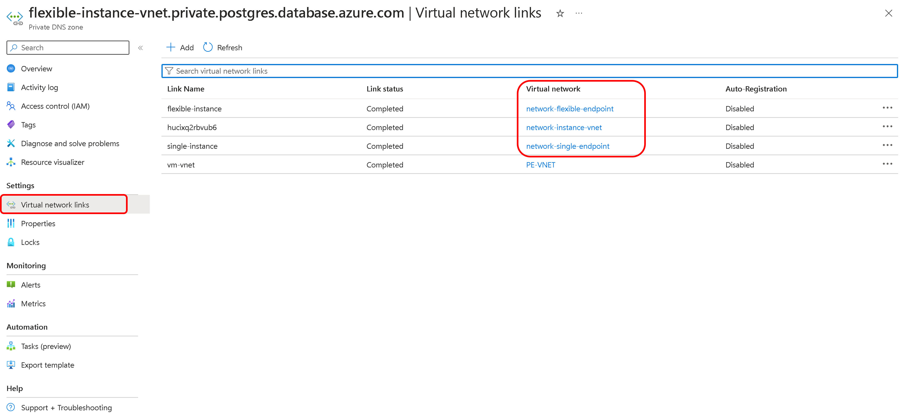
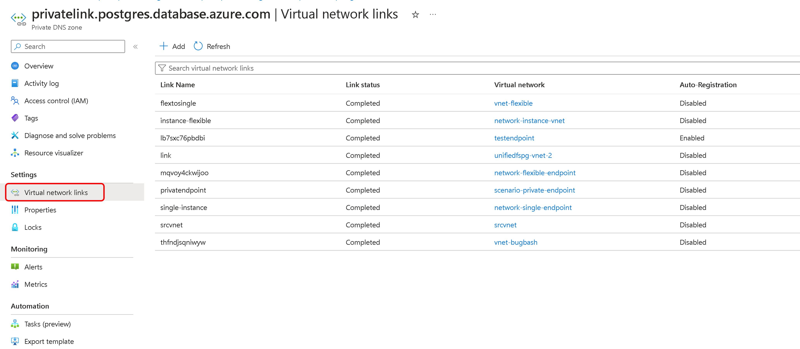

# Network guide using Migration Runtime Server

This document outlines networking scenario for connecting a source PostgreSQL instance to an Azure Database for PostgreSQL using the migration runtime server. Specific details vary based on the actual network setup and requirements of the source and target environments.

To configure network connectivity for migrations from an Azure Database for PostgreSQL - Single Server with a private endpoint to a Azure Database for PostgreSQL - Flexible Server with a private endpoint, using a VNet-integrated Flexible Server as the Migration Runtime Server, ensure private endpoint details, VNet peering, and DNS configurations are in place. This setup is also applicable for sources like on-premises databases, Azure VMs, or AWS instances with private IP access.

| Scenarios | Description |
| ---- | ---- |
| Scenario 1 | [Azure PostgreSQL Single Server with Private Endpoint to Flexible Server with Private Endpoint](#scenario-1-azure-postgresql-single-server-with-private-endpoint-to-flexible-server-with-private-endpoint) |
| Scenario 2 | [On-Premises/Azure VM/AWS with Private IPs to Flexible Server with Private Endpoint](#scenario-2-on-premisesazure-vmaws-with-private-ips-to-azure-postgresql-flexible-server-with-private-endpoint) |
| Scenario 3 | [Custom private DNS Zone attached to the private endpoint](#scenario-3-custom-private-dns-zone-attached-to-the-private-endpoint) |

## Scenario 1: Azure PostgreSQL Single Server with Private Endpoint to Flexible Server with Private Endpoint

Below are the essential networking steps for migrating from a Single Server with a private endpoint to a Flexible Server with a private endpoint in Azure PostgreSQL, including the integration of a runtime server's VNet with private endpoint configurations.

- **Gather Private Endpoint Details for Single Server**
    - Access the Azure portal and locate the Azure Database for PostgreSQL - Single Server instance.
    - Record the Virtual Network (VNet) and subnet details listed under the private endpoint connection of the Single Server.

    

- **Gather Private Endpoint Details for Flexible Server**
    - Access the Azure portal and locate the Azure Database for PostgreSQL - Flexible Server instance.
    - Record the Virtual Network (VNet) and subnet details listed under the private endpoint connection of the Flexible Server.

    

- **Gather VNET details for Migration Runtime Server**
    - Access the Azure portal and locate the migration runtime server i.e. Azure Database for PostgreSQL - Flexible Server (VNETc Integrated) instance.
    - Record the Virtual Network (VNet) and subnet details listed under the virtual network.

    

- **Assess VNet Peering Requirements**
    - Enable VNet peering if the servers are in different VNets; no peering is needed if they are in the same VNet but different subnets.
    - Ensure no NSGs are blocking traffic between the source, migration runtime and target servers.

- **Private DNS Zone Configuration**
    - Verify the use of a private DNS zone in the Networking blade of the Migration Runtime Server.
    - Ensure both source Azure Database for PostgreSQL - Single Server and target Azure Database for PostgreSQL - Flexible Server VNets are linked to the private DNS zone of the migration runtime server

    

    - Attach a private DNS zone to the Single Server's private endpoint if not already configured.
    - Add virtual network links for the Single Server and Migration Runtime Server to the private DNS zone.
    - Repeat the DNS zone attachment and virtual network linking process for the Flexible Server's private endpoint.

    

## Scenario 2: On-Premises/Azure VM/AWS with Private IPs to Azure PostgreSQL Flexible Server with Private Endpoint

Below are the networking steps for migrating a PostgreSQL database from an on-premises environment, Azure VM, or AWS instance—all of which are configured with private IPs—to an Azure Database for PostgreSQL Flexible Server that is secured with a private endpoint. The migration ensures secure data transfer within a private network space, leveraging Azure's VPN or ExpressRoute for on-premises connections and VNet peering or VPN for cloud-to-cloud migrations.

- **Establish Network Connectivity:**
   - For on-premises sources, set up a Site-to-Site VPN or ExpressRoute to connect your local network to Azure's VNet.
   - For Azure VM or AWS instances, ensure VNet peering or a VPN gateway or a ExpressRoute is in place for secure connectivity to Azure's VNet.

- **Gather VNET details for Migration Runtime Server**
    - Access the Azure portal and locate the migration runtime server i.e. Azure Database for PostgreSQL - Flexible Server (VNETc Integrated) instance.
    - Record the Virtual Network (VNet) and subnet details listed under the virtual network.

- **Assess VNet Peering Requirements**
    - Enable VNet peering if the servers are in different VNets; no peering is needed if they are in the same VNet but different subnets.
    - Ensure no NSGs are blocking traffic between the source, migration runtime and target servers.

- **Private DNS Zone Configuration**
    - Verify the use of a private DNS zone in the Networking blade of the Migration Runtime Server.
    - Ensure both source and target Azure Database for PostgreSQL - Flexible Server VNets are linked to the private DNS zone of the migration runtime server.
    - Attach a private DNS zone to the Flexible Server's private endpoint if not already configured.
    - Add virtual network links for the Flexible Server and Migration Runtime Server to the private DNS zone.

## Scenario 3: Custom private DNS Zone attached to the private endpoint

This scenario addresses the networking challenge when migrating databases to Azure PostgreSQL with a requirement to use Azure's default private DNS zone. Custom DNS configurations are incompatible with the Migration Runtime Server, necessitating the temporary use of Azure's default private DNS zone.

- Check if the source and target databases currently use custom DNS zones with their private endpoints.
- For both the source and target databases, set up new private endpoints that are linked to Azure's default private DNS zone.
- Connect the new private endpoints to the **privatelink.postgres.database.azure.com** DNS zone for proper name resolution.
- Ensure that the Migration Runtime Server can resolve and communicate with both databases using the new private endpoints.
- Carry out the database migration through the secondary endpoints that use the default private DNS zone.
- After successful migration, remove the secondary private endpoints and restore any custom DNS configurations if needed.