# Tutorial: Online migration of PostgreSQL to Azure Database for PostgreSQL - Flexible server using migration runtime server feature in portal

## Overview

You can migrate the PostgreSQL instance from Azure Database for PostgreSQL - single server/AWS/IaaS/On-Premises to Azure Database for PostgreSQL – Flexible Server using the Azure Portal. This document provides the detailed steps to migrate your PostgreSQL instances located in Azure Database for PostgreSQL - single server to Azure Database for PostgreSQL – Flexible Server using migration runtime server in portal.

> [!NOTE]
> Migration runtime server feature within migration service in Azure Database for PostgreSQL is in preview mode.

In this document, you will learn to -
> [!div class="checklist"]
> * Pre-Requisites
> * Configure the Migration task
> * Monitor the migration
> * Cancel the migration
> * Migration best practices

> [!NOTE]
> Recommended to use the Migration Runtime Server within migration service in Azure Database for PostgreSQL when migrating from private network sources, such as Azure Single Server or on-premises/AWS instances, to a Flexible Server with a private endpoint.

## Pre-Requisites

### Setup of Migration Runtime server
- Create a VNet-integrated Azure Database for PostgreSQL – Flexible Server as the Migration Runtime Server. 
- Choose a Azure Database for PostgreSQL – Flexible Server SKU that corresponds with the source's specifications.
- Refer to the quickstart guide for creating a Flexible Server: [Quickstart: Create server - Azure portal.](https://learn.microsoft.com/en-us/azure/postgresql/flexible-server/quickstart-create-server-portal)
- When configuring the Migration Runtime Server, it is not necessary to match the PostgreSQL version or set up High Availability (HA) and Disaster Recovery (DR) options, as the server's sole purpose is to facilitate the migration between the source and the target databases. The focus should be on ensuring the server has sufficient resources to handle the migration process efficiently.

### Target Setup

- Before starting the migration, Azure Database for PostgreSQL – Flexible server must be created. 
- SKU provisioned for Azure Database for PostgreSQL – Flexible server should be matching with the source.
- To create new Azure Database for PostgreSQL – Flexible server, refer link - [Quickstart: Create server - Azure portal - Azure Database for PostgreSQL - Flexible Server | Microsoft Learn](https://learn.microsoft.com/en-us/azure/postgresql/flexible-server/quickstart-create-server-portal)
 
### Source version
Source PostgreSQL version should be >= 9.5

### Enabling CDC as source
- wal2json logical decoding plugin is used to capture the changed records from the source.
- In the source PostgreSQL instance, set the following parameters and values in the `postgresql.conf` configuration file:
    - Set `wal_level = logical`
    - Set `max_replication_slots` to a value greater than 1, the value should be equal to greater than the number of databases selected for migration.
    - Set `max_wal_senders` to a value greater than 1, should be set to at least the same as `max_replication_slots`, plus the number of senders already used on your instance.
    - The `wal_sender_timeout` parameter ends replication connections that are inactive longer than the specified number of milliseconds. The default for an on-premises PostgreSQL database is `60000 milliseconds (60 seconds)`. Setting the value to 0 (zero) disables the timeout mechanism and is a valid setting for migration.

### Networking

- Networking is required to establish a successful connectivity between source, migration runtime server, and target.
- Integrate the virtual network of source's private endpoint or private IP, the Migration Runtime Server's, and the target's private endpoint appropriately.
- Refer the networking overview, [Network guide using Migration Runtime Server](concepts-network.md)

### Extensions
- Use the select command in the source to list all the extensions that are being used - `select extname,extversion from pg_extension;`
- Search for azure.extensions server parameter on the Server parameter blade on your Azure Database for PostgreSQL – Flexible server. Enable the extensions found in the source within the PostgreSQL flexible server.

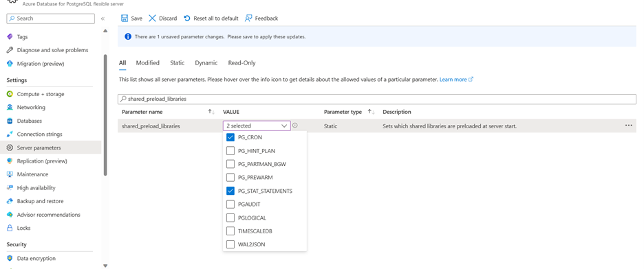

- Check if the list contains any of the following extensions - 
    - PG_CRON
    - PG_HINT_PLAN
    - PG_PARTMAN_BGW
    - PG_PREWARM
    - PG_STAT_STATEMENTS
    - PG_AUDIT
    - PGLOGICAL
    - WAL2JSON
If yes, go to the server parameters blade and search for shared_preload_libraries parameter. This parameter indicates the set of extension libraries that are preloaded at the server restart.

### Users and Roles

- The migration of user roles, ownerships, and privileges feature is available only for the Azure Database for PostgreSQL - Single server as the source.
- For other sources like AWS, Azure VM or on-premises the users, different roles must be migrated manually to the Azure Database for PostgreSQL – Flexible server. For migrating users and roles you can use `pg_dumpall --globals-only -U <<username> -f <<filename>>.sql`.
- Azure Database for PostgreSQL – Flexible server does not support any superuser, users having roles of superuser needs to be removed before migration.

### Server Parameters

- You need to manually configure the server parameter values in the Azure Database for PostgreSQL – Flexible server based on the server parameter values configured in the source.

## Configure the migration task

The migration service comes with a simple, wizard-based experience on the Azure portal. Here's how to start:

1. Open your web browser and go to the [portal](https://portal.azure.com/). Enter your credentials to sign in. The default view is your service dashboard.

2. Go to your Azure Database for PostgreSQL - Flexible Server as target.

3. In the **Overview** tab of the Flexible Server, on the left menu, scroll down to **Migration** and select it. 
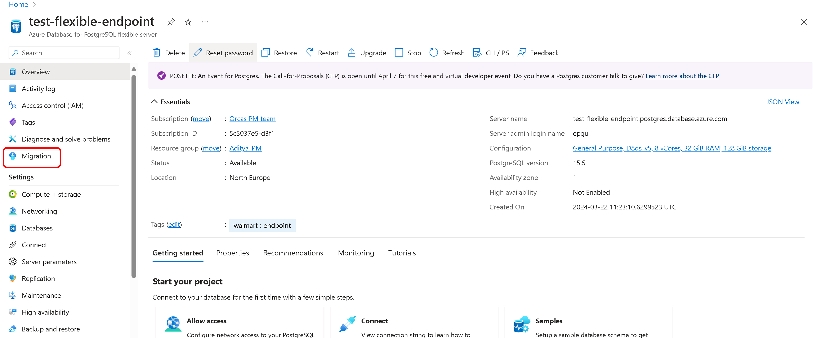

4. Select the **Create** button to start a migration from Azure Database for PostgreSQL - Single server to Azure Database for PostgreSQL - Flexible server. If this is the first time you're using the migration service, an empty grid appears with a prompt to begin your first migration.

  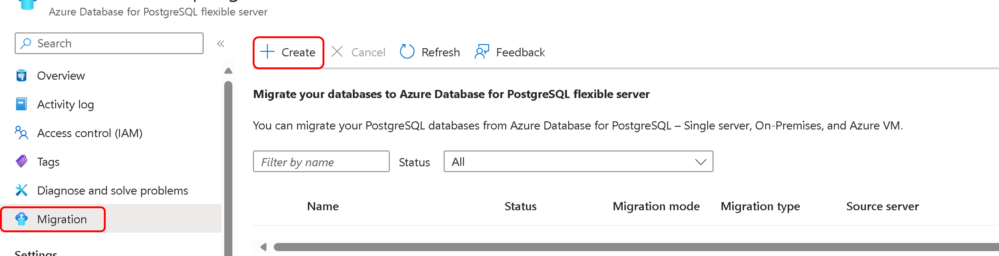

  If you've already created migrations to your Flexible Server target, the grid contains information about migrations that were attempted.

5. Select the **Create** button. You go through a wizard-based series of tabs to create a migration into this Flexible Server target from the PostgreSQL source Server.

### Setup

The first tab is the setup tab where user needs to provide migration details like migration name, source type to initiate the migrations
 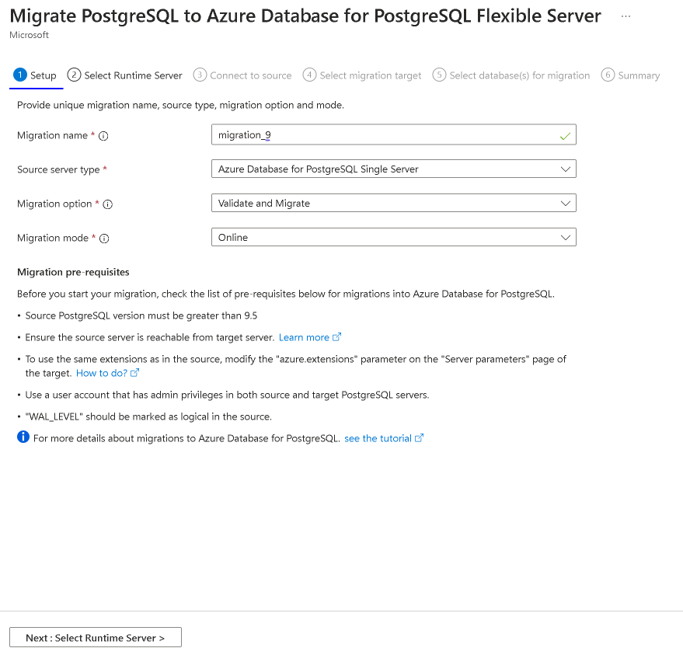

**Migration name** is the unique identifier for each migration to this Flexible Server target. This field accepts only alphanumeric characters and doesn't accept any special characters except a hyphen (-). The name can't start with a hyphen and should be unique for a target server. No two migrations to the same Flexible Server target can have the same name.

**Source Server Type** - Depending on your PostgreSQL source, you can select Azure Database for PostgreSQL - Single server, on-premises, Azure VM.

**Migration Option** gives you the option to perform validations before triggering a migration. You can pick any of the following options
 - **Validate** - Checks your server and database readiness for migration to the target.
 - **Migrate** - Skips validations and starts migrations.
 - **Validate and Migrate** - Performs validation before triggering a migration. Migration gets triggered only if there are no validation failures.

It is always a good practice to choose **Validate** or **Validate and Migrate** option to perform pre-migration validations before running the migration. To learn more about the pre-migration validation refer to this [documentation](./concepts-single-to-flexible.md#pre-migration-validations).

**Migration mode** gives you the option to pick the mode for the migration. **Offline** is the default option.

Select the **Next : Select Runtime Server** button.

### Select Runtime Server

The **Select Runtime Server** tab queries the user to determine the necessity of a runtime server for their workflow.

- Should the user opt `Yes`, indicating the need for a runtime server, they are prompted to input specific details to configure their environment. These details include:
    - **Subscription** - The Azure subscription ID where the runtime server resources are allocated.
    - **Resource Group** - The name of the resource group within the chosen subscription that organizes related resources for the runtime server.
    - **Server Name** - The unique identifier for the Flexible Server that will be used as the runtime environment. This server should not be confused with the target server for the operation.
- It is important to note that the selected Flexible Server must be VNet integrated to ensure proper network connectivity between source and target.
- If the user opts `No`, the system understands that a runtime server is not necessary for the operation. In this case, the migration will proceed directly from the target server, bypassing the need for a separate runtime server environment.

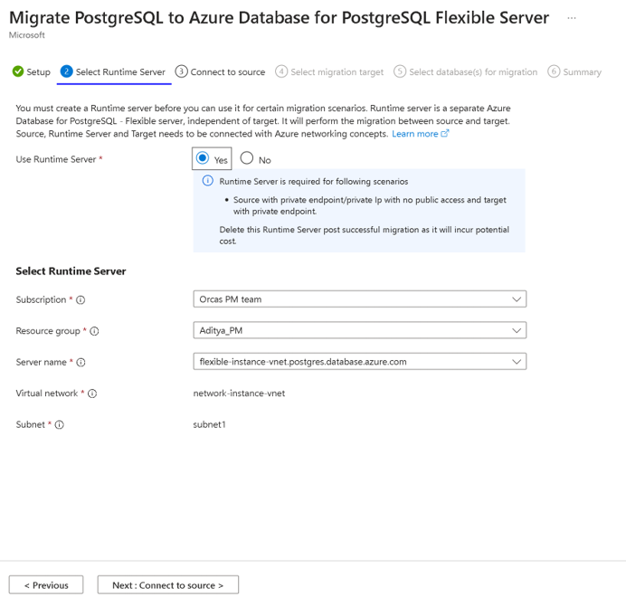

Select the **Next : Connect to Source** button.

### Connect to Source

The **Connect to Source** tab prompts you to give details related to the Single Server.

- After you make the Subscription and Resource Group selections, the dropdown list for server names shows Single Servers under that resource group across regions.
- Select the source that you want to migrate databases from. You can migrate databases from a Single Server to a target Flexible Server in the same region.
- Cross-region migrations are enabled only for India, China, and UAE servers.
- After you choose the Single Server source, the Location, PostgreSQL version, and Server admin login name boxes are populated automatically.
- The server admin sign-in name is the admin username used to create the Single Server. In the Password box, enter the password for that admin user. The migration service migrates single server databases as the admin user.

**Test Connection** - Performs the connectivity test between runtime server and source. Once the connection is successful, users can go ahead with the next step else need to identify the networking issues between runtime server and source, verify username/password for source. Test connection will take few minutes to establish connection between runtime server and source.

> [!NOTE]
> Test connection is performed via the runtime server.

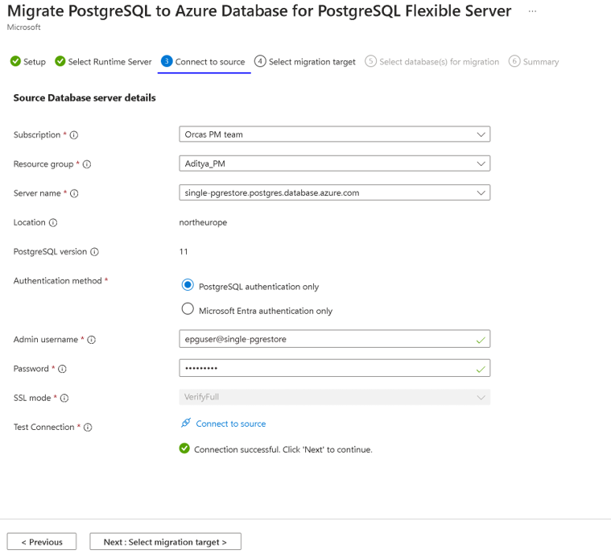

After the successful test connection, select the **Next: Select Migration target**

### Connect to Target

The **select migration target** tab displays metadata for the Flexible Server target, like subscription name, resource group, server name, location, and PostgreSQL version.
 
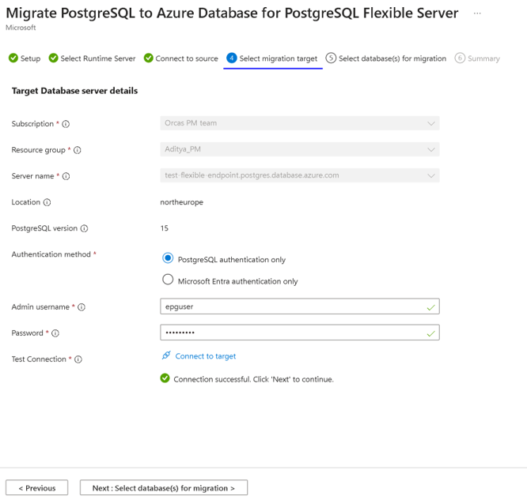

**Admin username** - Admin username of the target PostgreSQL server
**Password** - Password of the target PostgreSQL server
**Test Connection** - Performs the connectivity test between target and runtime server. Once the connection is successful, users can go ahead with the next step else need to identify the networking issues between target and runtime server, verify username/password for target. Test connection will take few minutes to establish connection between target and runtime server.

After the successful test connection, select the **Next: Select Database(s) for Migration**

### Select Databases for Migration

Under this tab, there is a list of user databases inside the source server selected in the setup tab. You can select and migrate up to eight databases in a single migration attempt. If there are more than eight user databases, the migration process is repeated between the source and target servers for the next set of databases.

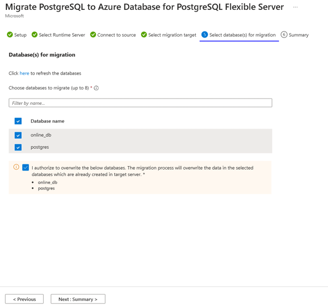

Post selecting the databases, select the **Next:Summary**

### Summary

The **Summary** tab summarizes all the source and target details for creating the validation or migration. Review the details and click on the start button.

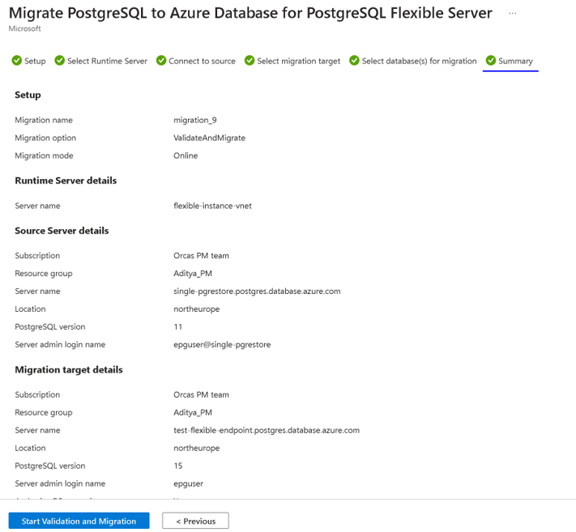

### Monitor the migration

After you click the start button, a notification appears in a few seconds to say that the validation or migration creation is successful. You are redirected automatically to the **Migration** blade of Flexible Server. This has a new entry for the recently created validation or migration.

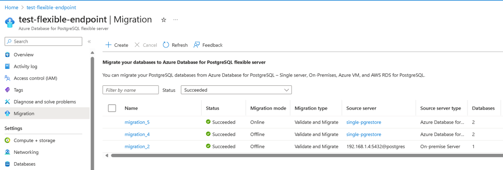

The grid that displays the migrations has these columns: **Name**, **Status**,  **Migration mode**, **Migration type**, **Source server**, **Source server type**, **Databases**, **Duration** and **Start time**. The entries are displayed in the descending order of the start time with the most recent entry on the top. You can use the refresh button to refresh the status of the validation or migration.
You can also select the migration name in the grid to see the associated details.

As soon as the validation or migration is created, it moves to the **InProgress** state and **PerformingPreRequisiteSteps** substate. It takes 2-3 minutes for the workflow to set up the migration infrastructure and network connections.

### Migration Details

In the Setup tab, we have selected the migration option as **Migrate and Validate**. In this scenario, validations are performed first before migration starts. After the **PerformingPreRequisiteSteps** sub state is completed, the workflow moves into the sub state of **Validation in Progress**. 

- If validation has errors, the migration will move into a **Failed** state.
- If validation completes without any error, the migration will start and the workflow will move into the sub state of **Migrating Data**. 

You can see the results of validation under the **Validation** tab and monitor the migration under the **Migration** tab.

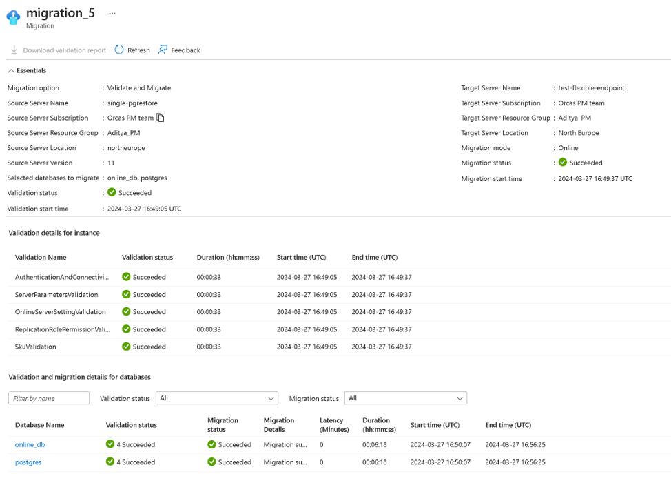

Possible migration states include:

- **InProgress**: The migration infrastructure setup is underway, or the actual data migration is in progress.
- **Canceled**: The migration is canceled or deleted.
- **Failed**: The migration has failed.
- **Validation Failed** : The validation has failed.
- **Succeeded**: The migration has succeeded and is complete.

Possible migration substates include:

- **PerformingPreRequisiteSteps**: Infrastructure set up is underway for data migration.
- **Validation in Progress**: Validation is in progress.
- **MigratingData**: Data migration is in progress.
- **CompletingMigration**: Migration is in final stages of completion.
- **Completed**: Migration has successfully completed.

### Cutover

In case of both **Migrate** as well as **Validate and Migrate**, completion of the Online migration requires another step - a Cutover action is required from the user. After the copy/clone of the base data is complete, the migration moves to `WaitingForUserAction` state and `WaitingForCutoverTrigger`` substate. In this state, user can trigger cutover from the portal by selecting the migration.

Before initiating cutover, it's important to ensure that:

- Writes to the source are stopped - `Latency (minutes)` parameter is 0 or close to 0 The `Latency (minutes)` information can be obtained from the migration details screen as shown below:
- 
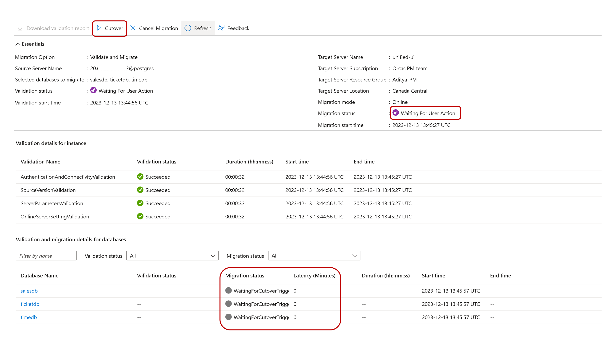

- `latency` value decreases to 0 or close to 0
- `latency` value indicates when the target last synced up with the source. At this point, writes to the source can be stopped and cutover initiated.In case there is heavy traffic at the source, it is recommended to stop writes first so that `Latency` can come close to 0 and then cutover is initiated.
- The Cutover operation applies all pending changes from the Source to the Target and completes the migration. If you trigger a "Cutover" even with non-zero `Latency`, the replication will stop until that point in time. All the data on source until the cutover point is then applied on the target. Say a latency was 15 minutes at cutover point, so all the change data in the last 15 minutes will be applied on the target. 
- Time taken will depend on the backlog of changes occurred in the last 15 minutes. Hence, it is recommended that the latency goes to zero or near zero, before triggering the cutover.

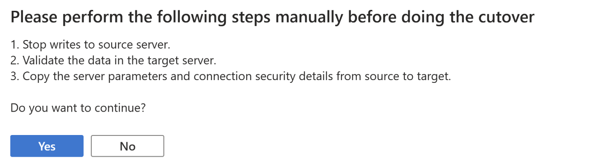

- The migration moves to the `Succeeded` state as soon as the `Migrating Data` substate or the cutover (in Online migration) finishes successfully. If there's a problem at the `Migrating Data` substate, the migration moves into a `Failed` state.

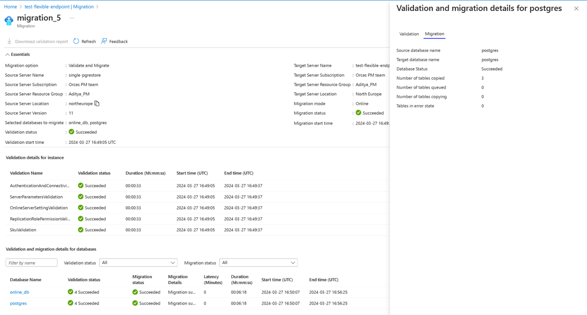

## Cancel the migration

You can cancel any ongoing validations or migrations. The workflow must be in the **InProgress** state to be canceled. You can't cancel a validation or migration that's in the **Succeeded** or **Failed** state.

Canceling a validation stops any further validation activity and the validation moves to a **Cancelled** state.
Canceling a migration stops further migration activity on your target server and moves to a **Cancelled** state. It doesn't drop or roll back any changes on your target server. Be sure to drop the databases on your target server involved in a canceled migration.

## Post Migration

After the migration has moved to the **Succeeded** state, follow the post-migration steps - 

- Once the migration is complete, verify the data on your flexible server and make sure it's an exact copy of the source server.
- Post verification, enable HA option as needed on your flexible server.
- Change the SKU of the flexible server to match the application needs. This change needs a database server restart.
- Make changes to your application to point the connection strings to flexible server.
- Monitor the database performance closely to see if it requires performance tuning.

## Migration best practices

For a successful end-to-end migration, follow the post-migration steps in [Migrate to Azure Database for PostgreSQL - Flexible Server](https://learn.microsoft.com/en-us/azure/postgresql/migrate/migration-service/best-practices-migration-service-postgresql). After you complete the preceding steps, you can change your application code to point database connection strings to Flexible Server. You can then start using the target as the primary database server.
