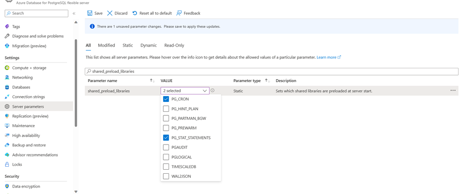

# Tutorial: Offline migration of On-Premises/IaaS to Azure Database for PostgreSQL - Flexible server using the Azure ARM Template

## Overview

You can migrate the PostgreSQL instance from Azure Database for PostgreSQL - Single server, AWS RDS, IaaS/On-Premises to Azure Database for PostgreSQL – Flexible Server using the Azure ARM Template. This document provides the detailed steps to migrate your PostgreSQL instances located in on-premises/Azure VM/IaaS based solutions to Azure Database for PostgreSQL – Flexible Server using custom ARM template based approach.
We spin up a purpose-built docker container in the target Azure Database for PostgreSQL – Flexible Server and drive the incoming migrations. This docker container spins up on-demand when a migration is initiated from On-premises/IaaS based solutions and gets decommissioned once the migration is completed. The migration container leverages [pgcopydb](https://github.com/dimitri/pgcopydb) that provides a fast and efficient way of copying databases from one server to another.

> [!NOTE]
> Offline migration using custom ARM Template is in preview mode.

In this document, you will learn to -
> [!div class="checklist"]
> * Pre-Requisites
> * Starting with Azure Custom Arm Template
> * End-to-end flow tutorial
> * Migration best practices

## Pre-Requisites

### Target Setup

* Before starting the migration, Azure Database for PostgreSQL – Flexible server must be created. 
* SKU provisioned for Azure Database for PostgreSQL – Flexible server should be matching with the source.
* To create new Azure Database for PostgreSQL – Flexible server, refer link - [Quickstart: Create server - Azure portal - Azure Database for PostgreSQL - Flexible Server | Microsoft Learn](https://learn.microsoft.com/en-us/azure/postgresql/flexible-server/quickstart-create-server-portal)
 
### Source version
Source PostgreSQL version should be >= 9.5

### Networking
Networking is required to establish a successful connectivity between source and target.
* You need to setup Express route/ IP Sec VPN/ VPN tunnelling while connecting your source from on-premises to Azure. Below table provides the networking scenario that can guide you with the connectivity setup

The following table can help for setting up the network between source and target
| Source | Target | Connectivity Tips |
| ---- | ---- | ---- |
| Public | Public | No action needed. Connectivity should be established automatically. Provided the source is whitelisted in the firewall rules. |
| Private | Public | Non supported network configuration, need to use pg_dump/pg_restore |
| Public | Private | No action needed. Connectivity should be established automatically. Provided the source is whitelisted in the firewall rules of the target. |
| Private | Private | You need to establish Express route or IP Sec VPN, or VPN Tunnelling or VNET Peering between source and target. |

* Along with establishing Azure connectivity, check the pg_hba.conf file to ensure the target PostgreSQL flexible server can connect to the source. It requires Source PostgreSQL instance to be restarted.
* To establish Express route - [Azure ExpressRoute Overview: Connect over a private connection | Microsoft Learn](https://learn.microsoft.com/en-us/azure/expressroute/expressroute-introduction)
* For setting up IP Sec VPN, you can refer - [About Azure Point-to-Site VPN connections - Azure VPN Gateway | Microsoft Learn](https://learn.microsoft.com/en-us/azure/vpn-gateway/point-to-site-about)
* For VNET Peering, [Azure Virtual Network peering | Microsoft Learn](https://learn.microsoft.com/en-us/azure/virtual-network/virtual-network-peering-overview)

### Extensions
* Use the select command in the source to list all the extensions that are being used - `select extname,extversion from pg_extension;`
* Search for azure.extensions server parameter on the Server parameter blade on your Azure Database for PostgreSQL – Flexible server. Enable the extensions found in the source within the PostgreSQL flexible server.



* Check if the list contains any of the following extensions - 
    * PG_CRON
    * PG_HINT_PLAN
    * PG_PARTMAN_BGW
    * PG_PREWARM
    * PG_STAT_STATEMENTS
    * PG_AUDIT
    * PGLOGICAL
    * WAL2JSON
If yes, go to the server parameters blade and search for shared_preload_libraries parameter. This parameter indicates the set of extension libraries that are preloaded at the server restart.


### Users and Roles
* The users, different roles must be migrated manually to the Azure Database for PostgreSQL – Flexible server. For migrating users and roles you can use `pg_dumpall --globals-only -U <<username> -f <<filename>>.sql`.
* Azure Database for PostgreSQL – Flexible server does not support any superuser, users having roles of superuser needs to be removed before migration.

### Server Parameters
* You need to manually configure the server parameter values in the Azure Database for PostgreSQL – Flexible server based on the server parameter values configured in the source.
* You can also configure the server parameters in the target using the CLI - [Configure parameters - Azure Database for PostgreSQL - Flexible Server | Microsoft Learn](https://learn.microsoft.com/en-us/azure/postgresql/flexible-server/howto-configure-server-parameters-using-cli)

## Starting with Azure Custom ARM template
ARM templates are JSON or Bicep files that define the resources you need to deploy for your solution. To understand the concepts associated with deploying and managing your Azure solutions, see [template deployment overview](https://learn.microsoft.com/en-us/azure/azure-resource-manager/templates/overview).

For performing migrations, you can use the provided JSON file and create the migration resource using the custom ARM templates. You can also save the template and reuse it later.

1. In a web browser, go to the [Azure portal](https://portal.azure.com/) and sign in.

1. From the Azure portal search bar, search for **deploy a custom template** and then select it from the available options.
   

1. select **Build your own template in the editor**.
   

1. You see a blank template.
   

1. Replace the blank template with the following template. It will initiate the migration in the respective Flexible server.
```bash
{
    "$schema": "https://schema.management.azure.com/schemas/2019-04-01/deploymentTemplate.json#",
    "contentVersion": "1.0.0.0",
    "metadata": {
        "description": "Template to create a migration from source PostrgeSQL Server to target Azure database for PostgreSQL Flexible Server and using offline"
    },
    "parameters": {
		"SourceType": {
			"defaultValue": "OnPremises",
            "allowedValues": [
                "OnPremises",
                "AzureVM"
            ],
            "type": "String",
            "metadata": {
                "description": "Migration source server type : OnPremises, AWS, GCP, AzureVM or PostgreSQLSingleServer"
            }
		},
        "targetServerName": {
            "type": "String",
            "metadata": {
                "description": "Target Azure database for PostgreSQL Flexible Server name to which data will be migrated"
            }
        },
        "migrationName": {
            "type": "String",
            "metadata": {
                "description": "Name of the migration from the source server to target server"
            }
        },
        "sourceServerResourceId": {
            "type": "String",
            "metadata": {
                "description": "ResourceID of the source server to be migrated"
            }
        },
        "sourceServerLoginName": {
            "minLength": 1,
            "type": "String",
            "metadata": {
                "description": "Login name for the source server"
            }
        },
        "sourceServerLoginPassword": {
            "minLength": 8,
            "type": "SecureString",
            "metadata": {
                "description": "Login password for the source server"
            }
        },
        "targetServerLoginName": {
            "minLength": 1,
            "type": "String",
            "metadata": {
                "description": "Login name for the target server"
            }
        },
        "targetServerLoginPassword": {
            "minLength": 8,
            "type": "SecureString",
            "metadata": {
                "description": "Login password for the target server"
            }
        },
        "location": {
            "defaultValue": "[resourceGroup().location]",
            "type": "String",
            "metadata": {
                "description": "Location for all resources."
            }
        },
        "dbNamesToMigrate": {
            "defaultValue": [],
            "type": "Array",
            "metadata": {
                "description": "String array containing the names of databases to be migrated from source server to target server."
            }
        },
		"migrationOption": {
			"defaultValue": "ValidateAndMigrate",
            "allowedValues": [
                "Validate",
                "Migrate",
				"ValidateAndMigrate"
            ],
            "type": "String",
            "metadata": {
                "description": "Supported types of migration request include Validate, Migrate and ValidateAndMigrate"
            }
		},
		"SslMode": {
			"defaultValue": "Prefer",
            "allowedValues": [
                "Prefer",
                "Require"
            ],
            "type": "String",
            "metadata": {
                "description": "Supported SSL modes for migration. VerifyFull is the recommended SSL mode for Single server migration. Prefer, Require are recommended SSL modes for other source types"
            }
		},
        "migrationMode": {
            "defaultValue": "Offline",
            "allowedValues": [
                "Offline"
            ],
            "type": "String",
            "metadata": {
                "description": "Mode of migration. This can be either Offline or Online"
            }
        },
        "overwriteDbsInTarget": {
            "defaultValue": "True",
            "allowedValues": [
                "True",
                "False"
            ],
            "type": "String",
            "metadata": {
                "description": "Indicates whether to overwrite DB in Target. Allowed values: \"True\" or \"False\""
            }
        }
    },
    "resources": [
        {
            "type": "Microsoft.DBforPostgreSQL/flexibleServers/migrations",
            "apiVersion": "2023-06-01-preview",
            "name": "[concat(parameters('targetServerName'), '/', parameters('migrationName'))]",
            "location": "[parameters('location')]",
            "properties": {
                "sourceDbServerResourceId": "[parameters('sourceServerResourceId')]",
                "dbsToMigrate": "[parameters('dbNamesToMigrate')]",
                "secretParameters": {
                    "adminCredentials": {
                        "sourceServerPassword": "[parameters('sourceServerLoginPassword')]",
                        "targetServerPassword": "[parameters('targetServerLoginPassword')]"
                    },
                    "sourceServerUsername": "[parameters('sourceServerLoginName')]",
                    "targetServerUsername": "[parameters('targetServerLoginName')]"
                },
                "migrationMode": "[parameters('migrationMode')]",
                "overwriteDbsInTarget": "[parameters('overwriteDbsInTarget')]",
				"migrationOption": "[parameters('migrationOption')]",
                "sslMode": "[parameters('SslMode')]",
                "sourceType": "[parameters('SourceType')]"
				
            }
        }
    ],
    "outputs": {}
}
```
1. Select **Save**.

1. You see the blade for providing deployment values. Again, select **myResourceGroup** for the resource group. You can use the other default values. When you're done providing values, select **Review + create**
  

1. After the portal validates the template, select **Create**.
   

1. When the deployment completes, you see the status of the deployment. If it is successful go to the respective target.
   

1. Once the deployment is successful, go to the respective Azure Database for PostgreSQL - Flexible server [target] and select Migration in the left pane. You can see the migration status in progress.
   

1. In the ARM template, we have selected the migration option as **Migrate and Validate**. In this scenario, validations are performed first before migration starts. After the **PerformingPreRequisiteSteps** sub state is completed, the workflow moves into the sub state of **Validation in Progress**.

- If validation has errors, the migration will move into a **Failed** state.
- If validation completes without any error, the migration will start and the workflow will move into the sub state of **Migrating Data**. 

You can see the results of validation under the **Validation** tab and monitor the migration under the **Migration** tab.


Possible migration states include:

- **InProgress**: The migration infrastructure setup is underway, or the actual data migration is in progress.
- **Canceled**: The migration is canceled or deleted.
- **Failed**: The migration has failed.
- **Validation Failed** : The validation has failed.
- **Succeeded**: The migration has succeeded and is complete.

Possible migration substates include:

- **PerformingPreRequisiteSteps**: Infrastructure set up is underway for data migration.
- **Validation in Progress**: Validation is in progress.
- **MigratingData**: Data migration is in progress.
- **CompletingMigration**: Migration is in final stages of completion.
- **Completed**: Migration has successfully completed.

## Cancel the migration

You can cancel any ongoing validations or migrations. The workflow must be in the **InProgress** state to be canceled. You can't cancel a validation or migration that's in the **Succeeded** or **Failed** state.

Canceling a validation stops any further validation activity and the validation moves to a **Cancelled** state.
Canceling a migration stops further migration activity on your target server and moves to a **Cancelled** state. It doesn't drop or roll back any changes on your target server. Be sure to drop the databases on your target server involved in a canceled migration.

## Post Migration

After the migration has moved to the **Succeeded** state, follow the post-migration steps - 
* Once the migration is complete, verify the data on your flexible server and make sure it's an exact copy of the source server.
* Post verification, enable HA option as needed on your flexible server.
* Change the SKU of the flexible server to match the application needs. This change needs a database server restart.
* Make changes to your application to point the connection strings to flexible server.
* Monitor the database performance closely to see if it requires performance tuning.

## Migration best practices

For a successful end-to-end migration, follow the post-migration steps in [Migrate to Azure Database for PostgreSQL - Flexible Server](https://learn.microsoft.com/azure/postgresql/migrate/concepts-single-to-flexible#post-migration). After you complete the preceding steps, you can change your application code to point database connection strings to Flexible Server. You can then start using the target as the primary database server.
