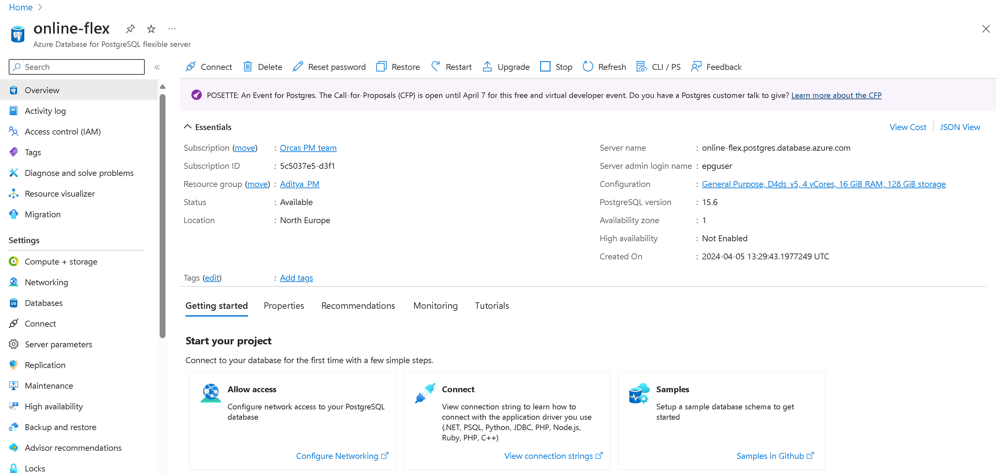
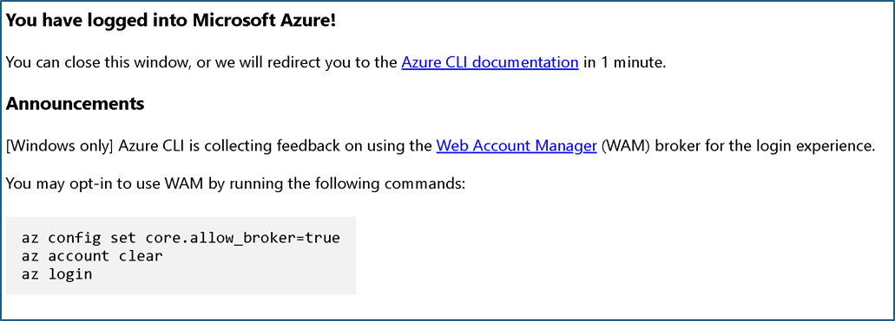
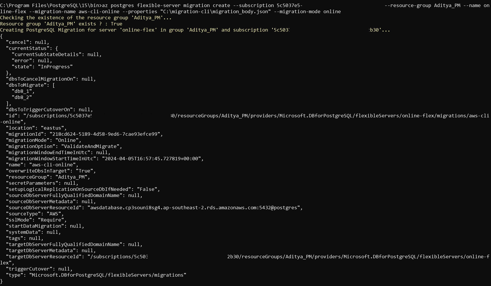
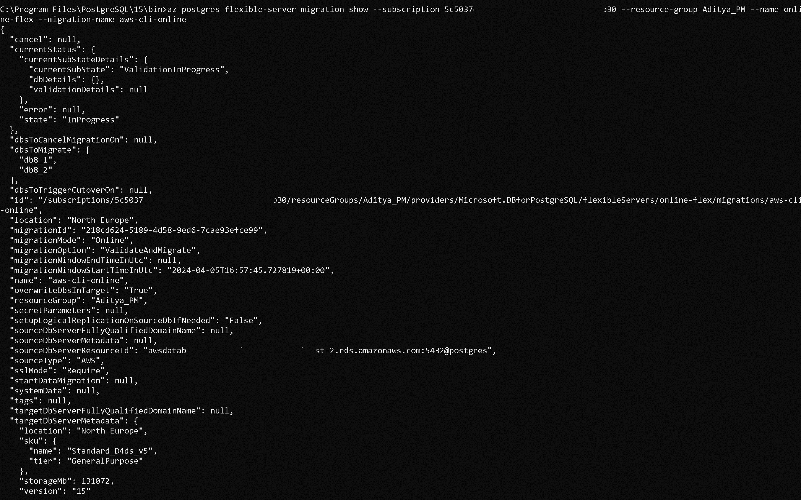
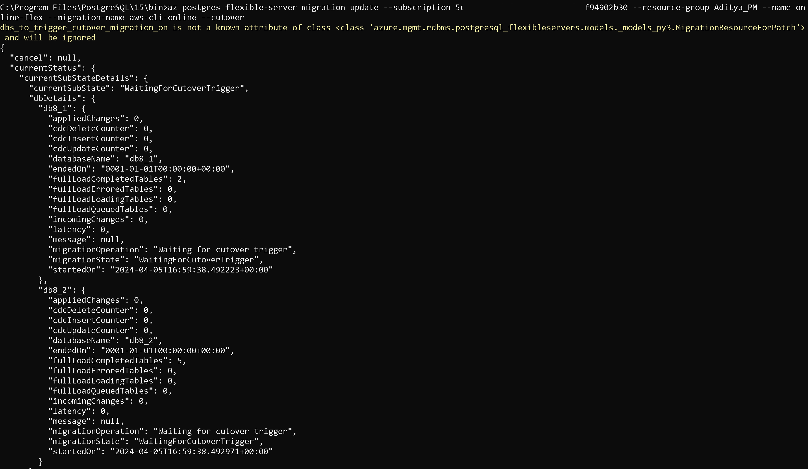
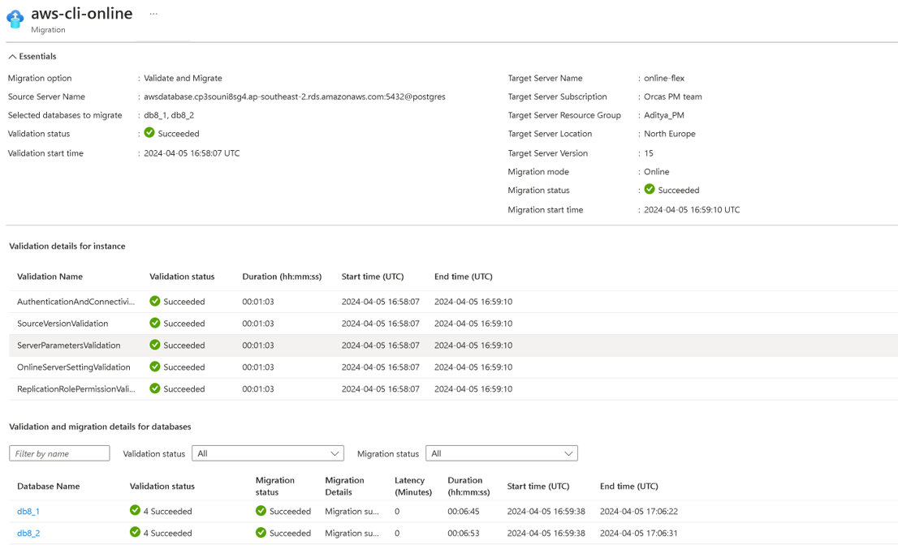

# Tutorial: Online migration of On-Premises/IaaS to Azure Database for PostgreSQL - Flexible server using the Azure CLI

## Overview

You can migrate the PostgreSQL instance from AWS RDS for PostgreSQL to Azure Database for PostgreSQL – Flexible Server using the Azure Command Line Interface (CLI). This document provides the detailed steps to migrate your PostgreSQL instances located in on-premises/Azure VM/IaaS based solutions to Azure Database for PostgreSQL – Flexible Server using CLI based approach.
 The migration service leverages [pgcopydb](https://github.com/dimitri/pgcopydb) that provides a fast and efficient way of copying databases from one server to another.

## How can it be initiated?
The migration service is currently exposed through easy-to-use Azure CLI commands. You can perform migrations, list migrations, etc using these CLI commands.

## Pre-Requisites

### Installing test_decoding - Source Setup

- **test_decoding** receives WAL through the logical decoding mechanism and decodes it into text representations of the operations performed.
- In Amazon RDS for PostgreSQL, the test_decoding plugin is pre-installed and ready to use for logical replication purposes. This allows you to easily set up logical replication slots and stream WAL changes, facilitating use cases such as change data capture (CDC) or replication to external systems.
- For more information about the test-decoding plugin, see the [PostgreSQL documentation](https://www.postgresql.org/docs/16/test-decoding.html)
    
### Azure CLI Setup

- Install the Azure CLI depending on the operating system to run the CLI commands.
- Azure CLI can be installed from - [How to install the Azure CLI | Microsoft Learn](https://learn.microsoft.com/en-us/cli/azure/install-azure-cli)
- In case Azure CLI is already installed, check the version by issuing az version command. The version should be at least 2.56.0 or above to use the private preview version of the CLI commands. If not, please update your Azure CLI using the following link.
- Once installed, run the az login command. This will open the default browser and load an Azure sign-in page to authenticate. Pass in your azure credentials to do a successful authentication. For other ways to sign with Azure CLI, visit this link.

### Target Setup

- Before starting the migration, Azure Database for PostgreSQL – Flexible server must be created. 
- SKU provisioned for Azure Database for PostgreSQL – Flexible server should be matching with the source.
- To create new Azure Database for PostgreSQL – Flexible server, refer link - [Quickstart: Create server - Azure portal - Azure Database for PostgreSQL - Flexible Server | Microsoft Learn](https://learn.microsoft.com/en-us/azure/postgresql/flexible-server/quickstart-create-server-portal)
 
### Source version

Source PostgreSQL version should be >= 9.5

### Enabling CDC as source

- test_decoding logical decoding plugin is used to capture the changed records from the source.
- In the source PostgreSQL instance, modify the following parameters by creating a new parameter group:
    - Set `rds.logical_replication = 1`
    - Set `max_replication_slots` to a value greater than 1, the value should be greater than the number of databases selected for migration.
    - Set `max_wal_senders` to a value greater than 1, should be set to at least the same as `max_replication_slots`, plus the number of senders already used on your instance.
    - The `wal_sender_timeout` parameter ends replication connections that are inactive longer than the specified number of milliseconds. The default for an AWS RDS for PostgreSQL instance is `30000 milliseconds (30 seconds)`. Setting the value to 0 (zero) disables the timeout mechanism and is a valid setting for migration.

### Networking

Networking is required to establish a successful connectivity between source and target.

- You need to setup Express route/ IP Sec VPN/ VPN tunnelling while connecting your source from on-premises/Azure virtual machine to Azure.
- For detailed information on the networking setup required when using the migration service in Azure Database for PostgreSQL, please refer to the following Microsoft documentation - [Migration Service in Azure Database for PostgreSQL network setup](https://learn.microsoft.com/en-us/azure/postgresql/migrate/migration-service/how-to-network-setup-migration-service)

### Extensions

- Use the select command in the source to list all the extensions that are being used - `select extname,extversion from pg_extension;`
- Search for azure.extensions server parameter on the Server parameter blade on your Azure Database for PostgreSQL – Flexible server. Enable the extensions found in the source within the PostgreSQL flexible server.


- Check if the list contains any of the following extensions - 
    - PG_CRON
    - PG_HINT_PLAN
    - PG_PARTMAN_BGW
    - PG_PREWARM
    - PG_STAT_STATEMENTS
    - PG_AUDIT
    - PGLOGICAL
    - WAL2JSON
If yes, go to the server parameters blade and search for shared_preload_libraries parameter. This parameter indicates the set of extension libraries that are preloaded at the server restart.


### Users or Roles

- The users, different roles must be migrated manually to the Azure Database for PostgreSQL – Flexible server. For migrating users and roles you can use `pg_dumpall --globals-only -U <<username> -f <<filename>>.sql`.
- Azure Database for PostgreSQL – Flexible server does not support any superuser, users having roles of superuser needs to be removed before migration.

### Server Parameters

- You need to manually configure the server parameter values in the Azure Database for PostgreSQL – Flexible server based on the server parameter values configured in the source.
- You can also configure the server parameters in the target using the CLI - [Configure parameters - Azure Database for PostgreSQL - Flexible Server | Microsoft Learn](https://learn.microsoft.com/en-us/azure/postgresql/flexible-server/howto-configure-server-parameters-using-cli)

## Starting with CLI

The CLI comes with a list of easy-to-use CLI commands to perform migration related tasks. All the CLI commands starts with “az postgres flexible-server migration”. There are also help statements provided to assist you in understanding the various options and in framing the right syntax for the CLI commands.

Once the CLI is installed, open the command prompt and login into the azure account using the below command.

Example with Windows command prompt - 
`az login`


## Commands

Let us take a deep dive of the CLI commands.

### help

Command ```az postgres flexible-server migration –-help``` will provide the name and the corresponding verbs that are supported in preview. 


### create

The create command helps in creating a migration from a source server to target server.

The help command will allow users to understand the different arguments used for creating and initiating the migration `az postgres flexible-server migration create --help`


Example - 
```bash
az postgres flexible-server migration create --subscription 11111111-1111-1111-1111-111111111111 --resource-group my-learning-rg --name myflexibleserver --migration-name migration1 --properties "C:\Users\Administrator\Documents\migrationBody.JSON" --migration-mode online
```

Different substates flow when the create command is triggered - 

- The migration moves to the InProgress state and the PerformingPreRequisiteSteps substate. 
- After the PerformingPreRequisiteSteps substate is completed, the migration moves to the substate of Migrating Data, where the Cloning/Copying of the databases take place.
- Each database migrated has its own section with all migration details, such as table count, incremental inserts, deletions, and pending bytes.
- The time that the Migrating Data substate takes to finish depends on the size of databases that are migrated.
- The migration moves to the Succeeded state as soon as the Migrating Data substate finishes successfully. If there's a problem at the Migrating Data substate, the migration moves into a Failed state.

Let us understand details of each parameter used in the create command –

| Parameter Name | Description |
| ---- | ---- |
| `subscription` | Subscription ID of PostgreSQL Flexible server |
| `resource-group` | Resource group of PostgreSQL Flexible server |
| `name` | Name of the PostgreSQL Flexible server |
| `migration-name` | Unique identifier to migrations attempted to Flexible Server. This field accepts only alphanumeric characters and does not accept any special characters, except a hyphen (-). The name can't start with -, and no two migrations to a Flexible Server target can have the same name. |
| `migration-mode` | This is an optional parameter. Default value: Offline. Offline migration involves copying of your source databases at a point in time, to your target server. |
| `properties` | Absolute path to a JSON file that has the information about the source server |

You need to provide a JSON file with the absolute path as parameter while initiating the migration. The properties of the JSON file are – 
| Property Name | Description |
| ----- | ----- |
| `sourceDbServerResourceId` | Source server details in the format - `<<hostname or IP address>>:<<port>>@<<username>>` |
| `AdminCredentials` | These parameter lists passwords for admin users for both the source server and the target PostgreSQL flexible server. These passwords help to authenticate against the source and target servers |
| `targetServerUserName` | The default value is the admin user created during the creation of flexible server and the password provided will be used for authentication against this user. In case you are not using the default user, this parameter is the user or role on the target server used for performing the migration. This user should be a member of azure_pg_admin, pg_read_all_settings, pg_read_all_stats, pg_stat_scan_tables roles and should have the Create role, Create DB attributes |
| `dbsToMigrate` | Specify the list of databases that you want to migrate to Flexible Server. You can include a maximum of eight database names at a time. Providing the list of DB’s in array format. |
| `OverwriteDBsInTarget` | When set to true (default), if the target server happens to have an existing database with the same name as the one you're trying to migrate, migration service automatically overwrites the database |
| `MigrationMode` | Mode of the migration. Supported value is "Offline" |
| `sourceType` | Required parameter. Values can be - OnPremises, AWS_RDS, AzureVM, PostgreSQLSingleServer |
| `sslMode` | SSL modes for migration. SSL mode for PostgreSQLSingleServer is VerifyFull and Prefer/Require for other source types |

### list

The list command lists all the migration attempts made to a Azure Database for PostgreSQL – Flexible server target.
```bash
az postgres flexible-server migration list [--subscription] [--resource-group][--name] [--filter]
```
| Parameter Name | Description |
| ----- | ----- |
| `subscription` | Subscription ID of PostgreSQL Flexible server target |
| `resource-group` | Resource group of PostgreSQL Flexible server target |
| `name` | Name of the PostgreSQL Flexible server target |
| `filter` | To filter migrations, two values supported – Active and All |

### show

The show command helps you monitor ongoing migrations and gives the current state and substate of the migration. These details include information on the current state and substate of the migration.
```bash
az postgres flexible-server migration show [--subscription][--resource-group][--name][--migration-name]
```
| Parameter Name | Description |
| ----- | ----- |
| `subscription` | Subscription ID of PostgreSQL Flexible server target |
| `resource-group` | Resource group of PostgreSQL Flexible server target |
| `name` | Name of the PostgreSQL Flexible server target |
| `migration-name` | Unique identifier to migrations attempted to Flexible Server. This field accepts only alphanumeric characters and does not accept any special characters, except a hyphen (-). The name can't start with -, and no two migrations to a Flexible Server target can have the same name. |

Different states and sub-states supported within show command

| Migration State | Description |
| ----- | ----- |
| `InProgress` | The migration infrastructure is set up, or the actual data migration is in progress |
| `Canceled` | The migration is canceled or deleted |
| `Failed` | The migration has failed |
| `Succeeded` | The migration has succeeded and is complete |

| Migration SubState | Description |
| ----- | ----- |
| `PerformingPreRequisiteSteps` | Infrastructure is set up and is prepped for data migration |
| `MigratingData` | Data migration is in progress |
| `Completed / Failed` | Migration is completed or failed |

### Cutover the migration

After the base data migration is complete, the migration task moves to `WaitingForCutoverTrigger` substate. In this state, user can trigger cutover from the portal by selecting the migration name in the migration grid or through CLI using the command below.

For example:

```azurecli-interactive
az postgres flexible-server migration update --subscription 11111111-1111-1111-1111-111111111111 --resource-group my-learning-rg --name myflexibleserver --migration-name CLIMigrationExample --cutover
```

Before initiating cutover it is important to ensure that:

- Writes to the source are stopped
- `latency` value decreases to 0 or close to 0
- `latency` value indicates when the target last synced up with the source. At this point, writes to the source can be stopped and cutover initiated.In case there is heavy traffic at the source, it is recommended to stop writes first so that `Latency` can come close to 0 and then cutover is initiated.
- The Cutover operation applies all pending changes from the Source to the Target and completes the migration. If you trigger a "Cutover" even with non-zero `Latency`, the replication will stop until that point in time. All the data on source until the cutover point is then applied on the target. Say a latency was 15 minutes at cutover point, so all the change data in the last 15 minutes will be applied on the target. 
- Time taken will depend on the backlog of changes occurred in the last 15 minutes. Hence, it is recommended that the latency goes to zero or near zero, before triggering the cutover.

The `latency` information can be obtained using the migration show command.
Here's a snapshot of the migration before initiating the cutover:


After cutover is initiated, pending data captured during CDC is written to the target and migration is now complete.

If the cutover is not successful, the migration moves to `Failed` state.

For more information about this command, use the `help` parameter.

## End to end flow tutorial

In this tutorial, we will be migrating PostgreSQL database residing in Azure VM with public access to Azure Database for PostgreSQL – Flexible server using Azure CLI.

### Step 1 - Connect to the source

- In this tutorial, source AWS RDS for PostgreSQL version used is 14.8
- For this tutorial we are going to migrate "db8_1","db8_2" and "postgres" into Azure Database for PostgreSQL – Flexible server.


### Step 2 - Create target Azure Database for PostgreSQL – Flexible server

We used the [QuickStart guide](https://learn.microsoft.com/en-us/azure/postgresql/flexible-server/quickstart-create-server-portal) to create a corresponding PostgreSQL target flexible server. Below is the target server screenshot once created –



### Step 3 - Setup the pre-requisites

Ensure that all the pre-requisites are completed before start of migration.

- Networking establishment between source and target.
- Azure CLI environment and all the appropriate defaults are setup.
- Extensions are allowed listed and included in shared-load libraries.
- Users or Roles are migrated.
- Server Parameters are configured appropriately.

### Step 4 - Perform migration using CLI

- Open the command prompt and login into the Azure using `az login` command




* Edit the below placeholders `<< >>` in the JSON lines and store in the local machine as `<<filename>>.json` where the CLI is being invoked. In this tutorial, we have saved the file in C:\migration-cli\migration_body.json

```bash
{
"properties": {
"SourceDBServerResourceId": "<<hostname or IP address>>:<<port>>@<<username>>",
		"SecretParameters": {
			"AdminCredentials": {
				"SourceServerPassword": "<<Source Password>>",
				"TargetServerPassword": "<<Target Password>>"
			}
		},
     "targetServerUserName":"<<Target username>>",
		"DBsToMigrate": [
			<< comma separated list of databases like - "db8_1","db8_2" >>
		],
		"OverwriteDBsInTarget": "true",
		"MigrationMode": "Online",
    "sourceType": "AWS_RDS",
    "sslMode": "Require"
	}
}
```

- Run the following command, to check if there are any migrations already performed. The migration name is the unique across the migrations within the Azure Database for PostgreSQL – Flexible server target.

```bash
az postgres flexible-server migration list --subscription <<subscription ID>> --resource-group <<resource group name>> --name <<Name of the Flexible Server>> --filter All
```

- In the above steps, there are no migrations performed so we will start with the new migration by running the following command –

```bash
az postgres flexible-server migration create --subscription <<subscription ID>> --resource-group <<resource group name>> --name <<Name of the Flexible Server>> --migration-name <<Unique Migration Name>> --properties "C:\migration-cli\migration_body.json"
```


- Run the following command to get the status of the migration that got initiated in the previous step. You can check the status of the migration by providing the migration name

```bash
az postgres flexible-server migration show --subscription <<subscription ID>> --resource-group <<resource group name>> --name <<Name of the Flexible Server>> --migration-name <<Migration ID>>
```



- In Online migrations, after the base data migration is complete, the migration task moves to `WaitingForCutoverTrigger` substate. In this state, user can trigger cutover through CLI using the command below. The cutover can also be triggered from the portal by selecting the migration name in the migration grid.

```bash
az postgres flexible-server migration update --subscription <<subscription ID>> --resource-group <<resource group name>> --name <<Name of the Flexible Server>> --migration-name <<Unique Migration Name>> --cutover
```




-  You can also see the status in the Azure Database for PostgreSQL – Flexible server portal



### Step 5 - Post Migration

After completing the migration successfully, you need to manually validate the data between source and target and verify that all the objects in the target database are successfully created.

After migration, you can perform the following tasks:

- Verify the data on your flexible server and ensure it's an exact copy of the source instance.
- Post verification, enable the high availability option on your flexible server as needed.
- Change the SKU of the flexible server to match the application needs. This change needs a database server restart.
- If you change any server parameters from their default values in the source instance, copy those server parameter values in the flexible server.
- Copy other server settings like tags, alerts, and firewall rules (if applicable) from the source instance to the flexible server.
- Make changes to your application to point the connection strings to a flexible server.
- Monitor the database performance closely to see if it requires performance tuning.

## Migration best practices

For a successful end-to-end migration, follow the post-migration steps in [Migrate to Azure Database for PostgreSQL - Flexible Server](https://learn.microsoft.com/en-us/azure/postgresql/migrate/migration-service/best-practices-migration-service-postgresql). After you complete the preceding steps, you can change your application code to point database connection strings to Flexible Server. You can then start using the target as the primary database server.
